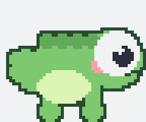

# PlayableKit

A SpriteKit-based library that adds an interactive pixel-art character to any iOS app. The character wanders across the screen, walks to registered UI elements, and performs context-aware animations (sitting on tab bars, jumping on buttons, walking along navigation bars).

<p align="center">
  
</p>

## Requirements

- iOS 16+
- Swift 6.0+
- SpriteKit

## Installation

### Swift Package Manager

```swift
dependencies: [
    .package(url: "https://github.com/noahplutzer/swift-playable-kit", from: "1.0.0")
]
```

## Quick Start

### 1. Start the engine

Call `start()` once at app launch — in `AppDelegate`, `@main App`, or a root coordinator.

```swift
PlayableEngine.shared.start()
```

To use custom sprites, point the engine at a local directory of PNG files:

```swift
let sprites = SpriteSet(directory: mySpritesURL)
PlayableEngine.shared.start(spriteSet: sprites)
```

Or try it instantly with the bundled example — a cute pixel-art chameleon (shown above):

```swift
PlayableEngine.shared.start(spriteSet: .exampleChameleon)
```

The example frames are generated by [`Tools/generate_chameleon_sprites.py`](Tools/generate_chameleon_sprites.py); run it to tweak the art or to produce your own set in the same format.

### 2. Register views (SwiftUI)

Use the `.playable(kind:id:)` modifier. Use a stable ID — do not pass `UUID().uuidString` inline, as SwiftUI re-evaluates the call-site on every render.

```swift
private let cardID = UUID().uuidString

var body: some View {
    ProductCard()
        .playable(kind: .card, id: cardID)
}
```

Receive a callback when the character interacts with the view:

```swift
ProductCard()
    .playable(kind: .button, id: cardID, options: InteractionOptions(priority: 2)) {
        highlightCard()
    }
```

### 3. Register views (UIKit)

```swift
myButton.makePlayable(kind: .button)
tabBar.makePlayable(kind: .tabBar, options: InteractionOptions(priority: 5))
```

Cleanup is automatic — the view is unregistered when it leaves the window hierarchy.

## Sprite Format

Sprites are flat PNG sequences in a directory:

```
idle_00.png   idle_01.png   idle_02.png
walk_00.png   walk_01.png
rolling_00.png              // walkingOnTop
attention_00.png            // sitting
fainting_00.png             // jumping
attacking_00.png            // interacting
wave_00.png   wave_01.png
```

If no sprite set is provided the engine uses a built-in placeholder drawn with Core Graphics.

## Lifecycle

```swift
PlayableEngine.shared.pause()   // e.g. on app background
PlayableEngine.shared.resume()  // e.g. on app foreground
PlayableEngine.shared.stop()    // removes the overlay entirely
```

## Interaction Options

```swift
InteractionOptions(
    canSit: true,
    canJump: true,
    canWalk: true,
    priority: 0     // higher = preferred by the engine's random selector
)
```

## Kind → Interaction mapping

| Kind | Default interaction |
|---|---|
| `.button` | interact |
| `.tabBar` | sit |
| `.card` | walkOnTop |
| `.navigationBar` | walk |
| `.dynamicIsland` | wave |
| `.custom(_)` | idle |

## Engine configuration

Tune how often the character seeks out a registered view to interact with:

```swift
PlayableEngine.shared.interactionInterval = 8            // base seconds between interactions
PlayableEngine.shared.interactionIntervalRange = 5...30  // randomised delay bounds

PlayableEngine.shared.triggerRandomInteraction()         // trigger one immediately
```

Swap the sprite set at runtime without restarting the engine:

```swift
PlayableEngine.shared.configure(spriteSet: SpriteSet(directory: mySpritesURL))
```

## Demo

A sample app demonstrating both SwiftUI and UIKit registration lives in `Demo/PlayableKitDemo`.

## License

Released under the MIT License. See [LICENSE](LICENSE).
